# River Diary

Vodácký deník pro ukládání sjezdů, posádek, lodí, tras a aktuálních vodních stavů. Aplikace pomáhá plánovat i zpětně archivovat vodácké výlety, porovnává sledované úseky podle ČHMÚ vodočtů a doplňuje orientační sjízdnost podle vodáckých limitů.

## Preview build

[Otevřít preview build v EAS](https://expo.dev/accounts/krejzy23/projects/river-diary/builds/8769a8fe-900e-4939-ac18-77141384bf81)

Preview profil je nastavený jako interní distribuce v `eas.json`, takže instalace může vyžadovat přístup k Expo/EAS projektu nebo registrované testovací zařízení.

## Screenshoty appky

<table>
  <tr>
    <td>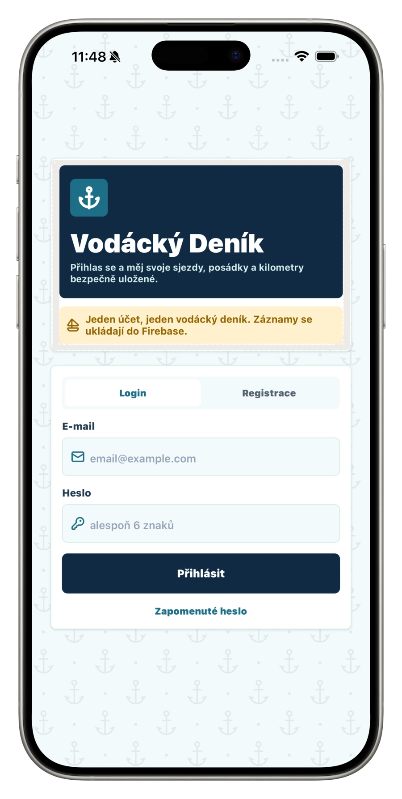</td>
    <td>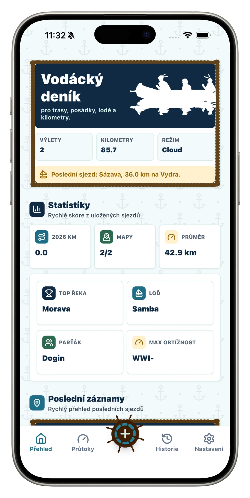</td>
    <td>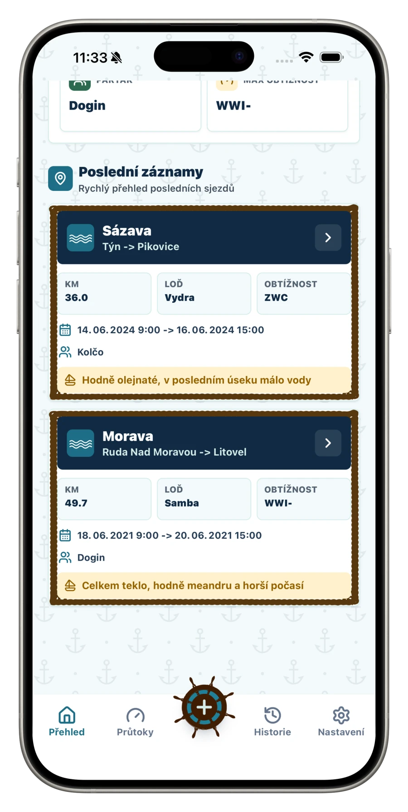</td>
  </tr>
  <tr>
    <td>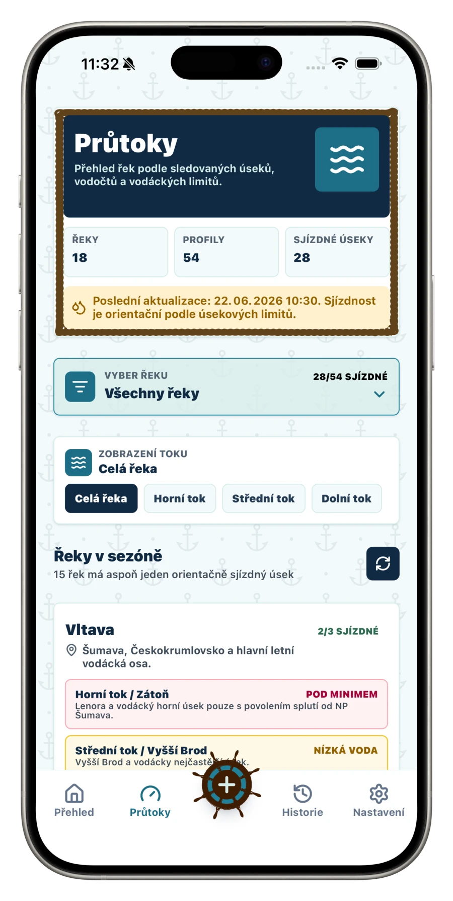</td>
    <td>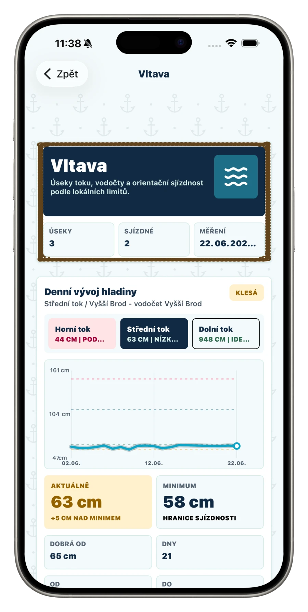</td>
    <td>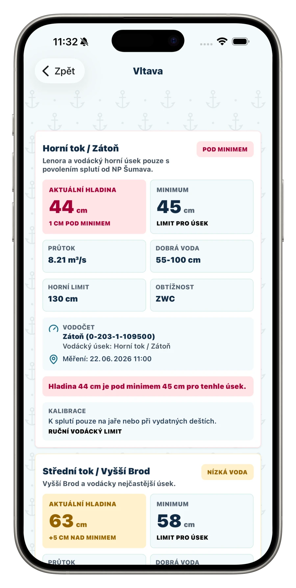</td>
  </tr>
  <tr>
    <td>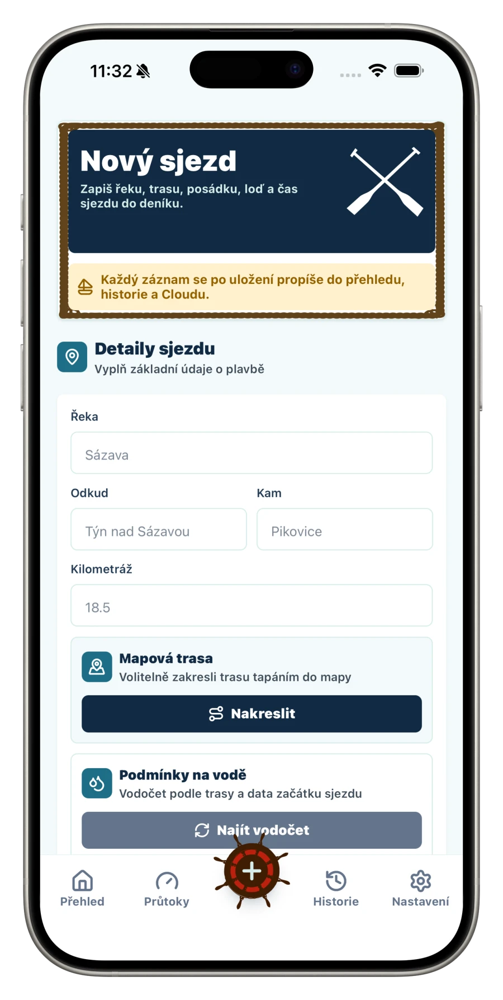</td>
    <td>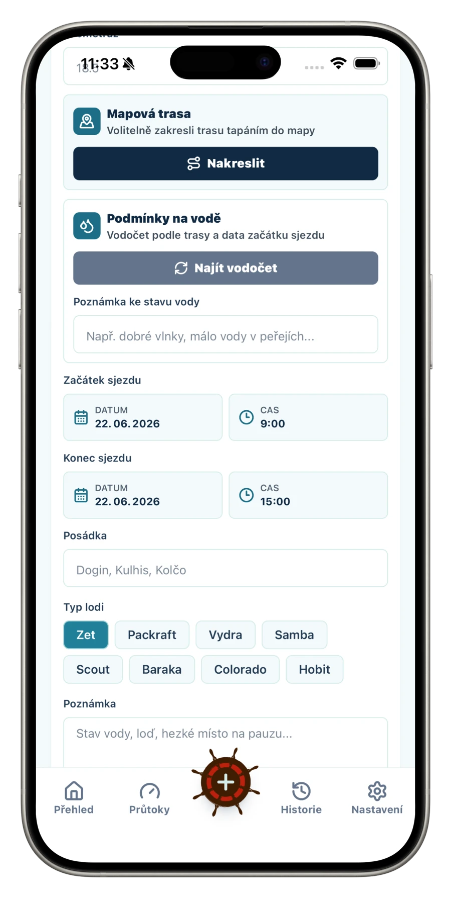</td>
    <td>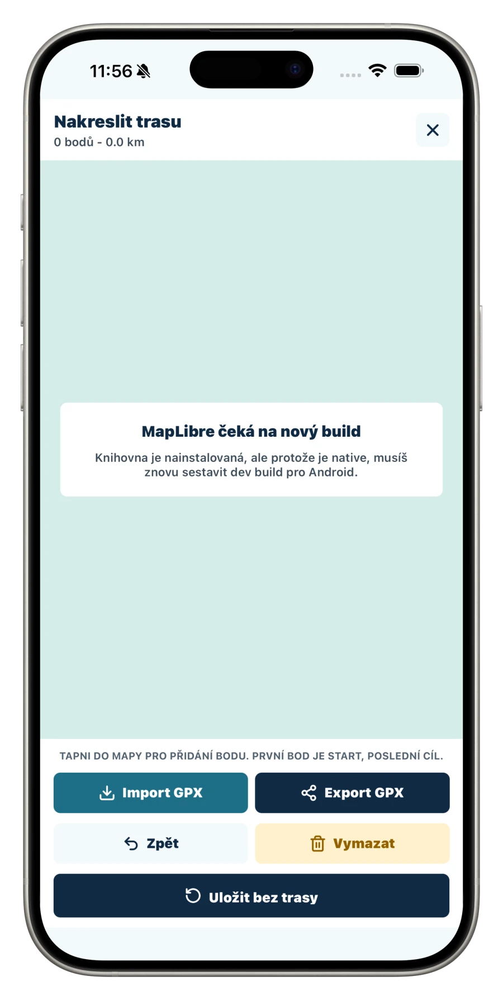</td>
  </tr>
  <tr>
    <td>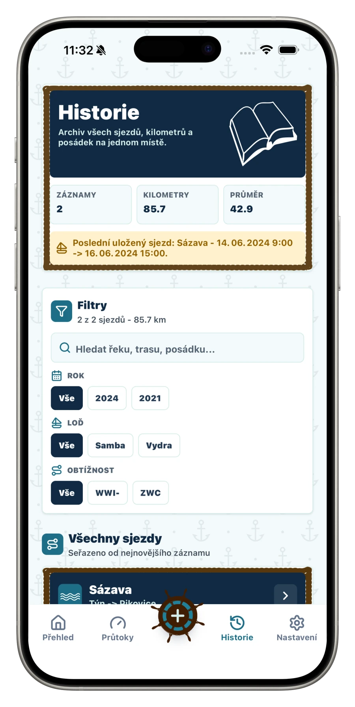</td>
    <td>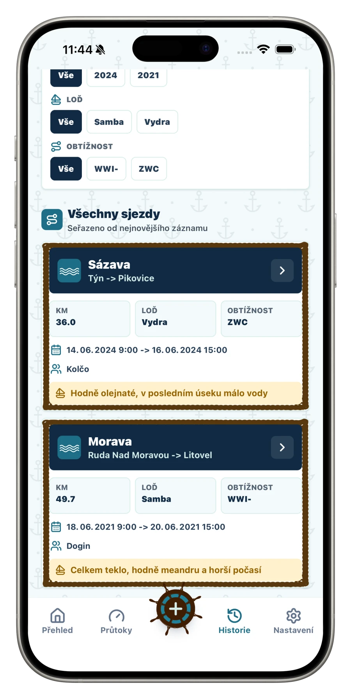</td>
    <td>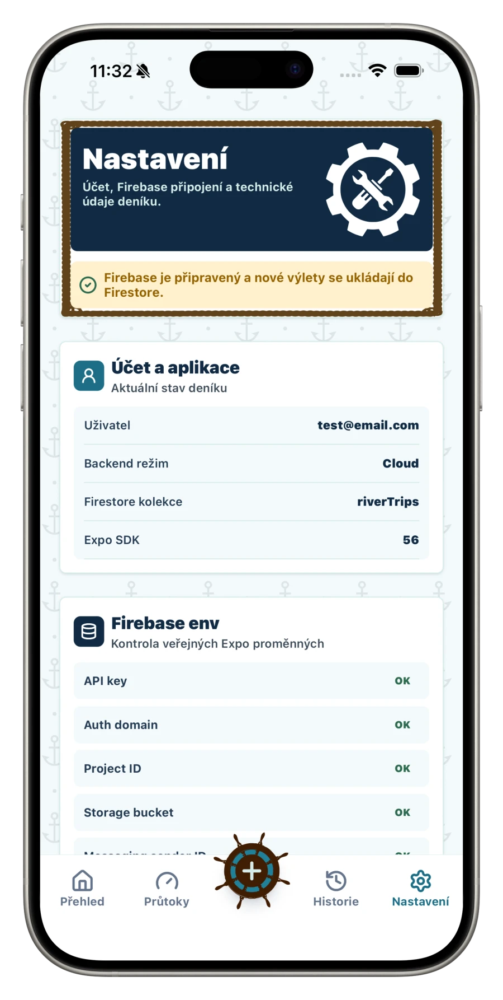</td>
  </tr>
</table>

## Funkce

- ukládání vodáckých výletů do vlastního účtu
- Firebase Auth a Firestore cloud synchronizace
- offline/local fallback režim, pokud není Firebase konfigurace dostupná
- evidence řeky, úseku, kilometráže, posádky, typu lodě, obtížnosti a poznámek
- automatické doplnění vodního stavu podle vodočtu a data výletu
- přehled aktuálních průtoků a hladin z ČHMÚ open dat
- vodácké limity pro úseky řek včetně orientační sjízdnosti
- detail řeky s profily, obtížností, limity a historickým grafem hladiny
- historie výletů s filtrováním a statistikami
- mapa trasy přes MapLibre
- export a sdílení trasy ve formátu GPX
- sdílecí karta výletu přes screenshot/export

## Použité technologie

- Expo SDK 56
- React Native 0.85
- React 19
- TypeScript 6
- React Navigation 7
- Firebase JS SDK, Firebase Auth a Cloud Firestore
- ČHMÚ open data API
- MapLibre React Native
- NativeWind 5 preview, Tailwind CSS 4 a `react-native-css`
- React Native Reanimated 4
- React Native SVG a `react-native-svg-transformer`
- Lucide React Native ikony
- Expo FileSystem, DocumentPicker a Sharing
- React Native ViewShot
- AsyncStorage
- React Native DateTimePicker

## Lokální spuštění

Projekt používá Node.js 22.

```sh
npm install
npm start
```

Další užitečné příkazy:

```sh
npm run ios
npm run android
npm run web
npm run typecheck
```

Pro běžné UI testování stačí Expo Go. Kvůli nativním částem, například MapLibre, je pro plné testování potřeba development nebo preview build.

## Preview build přes EAS

```sh
npx eas build --profile preview --platform android
npx eas build --profile preview --platform ios
```

Konfigurace build profilů je v `eas.json`. Preview profil používá interní distribuci.

## Firebase konfigurace

Firebase hodnoty patří do lokálního `.env` souboru a nemají se commitovat do repozitáře.

```sh
EXPO_PUBLIC_FIREBASE_API_KEY=
EXPO_PUBLIC_FIREBASE_APP_ID=
EXPO_PUBLIC_FIREBASE_AUTH_DOMAIN=
EXPO_PUBLIC_FIREBASE_MESSAGING_SENDER_ID=
EXPO_PUBLIC_FIREBASE_PROJECT_ID=
EXPO_PUBLIC_FIREBASE_STORAGE_BUCKET=
```

Aplikace ukládá výlety do Firestore kolekce `riverTrips`. Každý záznam je svázaný s `ownerId`, aby uživatel viděl jen vlastní data.

## Datové zdroje

Vodní stavy a průtoky se načítají z ČHMÚ open dat. Sjízdnost je orientační a vychází z ručně doplněných limitů pro konkrétní vodočty a úseky řek.

## Poznámky

- `lightningcss` je pinované na `1.30.1` kvůli stabilitě iOS bundlingu.
- NativeWind v5 používá Tailwind v4 tokeny definované v `global.css`.
- Route souřadnice jsou omezené limitem aplikace i Firestore pravidly.
